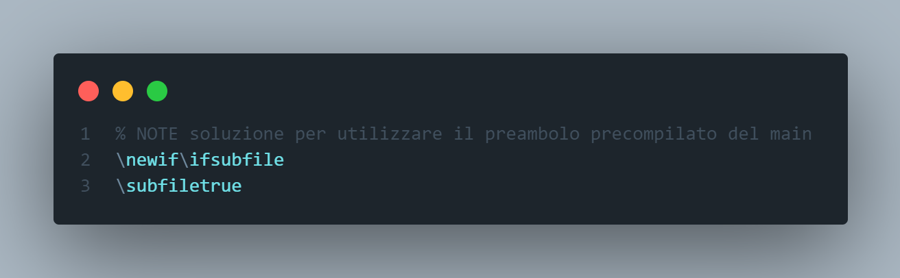
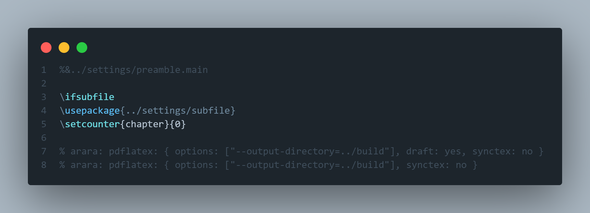

# 1. Contribuire a questo progetto

Ciao! 👋🏻 Sono entusiasta che tu voglia contribuire a questo progetto.
Il tuo aiuto sarà essenziale per mantenerlo alla grande!

- [1. Contribuire a questo progetto](#1-contribuire-a-questo-progetto)
  - [1.1. Requisiti per la compilazione 📌](#11-requisiti-per-la-compilazione-)
    - [1.1.1. Installazione dei requisiti su Windows](#111-installazione-dei-requisiti-su-windows)
    - [1.1.2. Installazione dei requisiti su linux](#112-installazione-dei-requisiti-su-linux)
    - [1.1.3. Controllo installazione 👀](#113-controllo-installazione-)
  - [1.2. Come compilare il progetto ⚙️](#12-come-compilare-il-progetto-️)
    - [1.2.1. Effettuare modifiche al preambolo del documento](#121-effettuare-modifiche-al-preambolo-del-documento)
  - [1.3. Come effettuare un commit 🧐](#13-come-effettuare-un-commit-)
  - [1.4. Cosa succede quando si pubblica il codice su Github ✨](#14-cosa-succede-quando-si-pubblica-il-codice-su-github-)
  - [1.5. Estensioni VSCode consigliate 📦](#15-estensioni-vscode-consigliate-)
  - [1.6. Docker 🐳](#16-docker-)
    - [1.6.1. Installare docker](#161-installare-docker)
    - [1.6.2. Come configurare il progetto con VSCode](#162-come-configurare-il-progetto-con-vscode)
  - [1.7. Principali pacchetti LaTeX impiegati 📃](#17-principali-pacchetti-latex-impiegati-)
    - [1.7.1. Compilazione singoli capitoli](#171-compilazione-singoli-capitoli)
    - [1.7.2. Algoritmi e pseudocodice](#172-algoritmi-e-pseudocodice)
    - [1.7.3. Grafici e alberi](#173-grafici-e-alberi)
  - [1.8. Dump preambolo ⏩](#18-dump-preambolo-)
    - [1.8.1. Motivazione](#181-motivazione)
    - [1.8.2. Funzionamento ed utilizzo](#182-funzionamento-ed-utilizzo)

## 1.1. Requisiti per la compilazione 📌

<!-- markdownlint-disable -->
<p>
  </a>
  <a href="https://git-scm.com/">
  

  </a>
  <a href="https://www.tug.org/texlive/acquire-netinstall.html">
  
  </a>

  </a>
  <a href="https://www.java.com/it/download/">
  
  </a>

  </a>
  <a href="https://www.python.org/downloads/">
  
  </a>

  </a>
  <a href="https://pygments.org/">
  
  </a>
</p>
<!-- markdownlint-restore -->

Per poter compilare questo progetto è necessario avere sulla propria macchina:

- [Git](https://git-scm.com/)
- un'installazione completa di [TeX Live](https://www.tug.org/texlive/acquire-netinstall.html) 2020 (servono all'incirca 7GB liberi sul disco);
- [Python](https://www.python.org/downloads/) (`2.x.x` o `3..x.x` è indifferente);
- la [libreria Python `pygmetize`](https://pygments.org/) (per la colorazione del codice all'interno del documento);
- [Java](https://www.java.com/it/download/) (per la compilazione dei documenti tramite [arara 🦜](https://github.com/islandoftex/arara) che viene scaricato con TeX Live).

### 1.1.1. Installazione dei requisiti su Windows

Per l'installazione su windows eseguire i passi nei seguenti link:

- installare git ([download diretto](https://git-scm.com/download/win));
- installare Tex-Live per Windows ([download diretto](http://mirror.ctan.org/systems/texlive/tlnet/install-tl-windows.exe));
- installare una versione di [Python](https://www.python.org/downloads/), dopodiché eseguire `pip install Pygments` su un terminale;
- installare [Java](https://www.java.com/en/download/).

### 1.1.2. Installazione dei requisiti su linux

Su linux è sufficiente eseguire le seguenti righe

```bash
sudo apt -y update && sudo apt -y upgrade && sudo apt autoremove
sudo apt install git
sudo apt install -y default-jre default-jdk
sudo apt install -y python3-pygments
sudo apt install -y texlive-full
tlmgr init-usertree # initialize tlmgr
tlmgr update --self --all
```

### 1.1.3. Controllo installazione 👀

Per accertarti di avere tutti gli strumenti adatti per compilare questo progetto (sia su linux che su windows) esegui le seguenti righe su un terminale:

```bash
git --version
python --version
pygmentize -V
tlmgr --version
arara --version
```

## 1.2. Come compilare il progetto ⚙️

Scarica una copia del progetto

```bash
git clone https://github.com/emanuelenardi/latex-algorithms.git
```

> Se lavori su linux/mac controlla che il carattere di fine riga dell'editor sia impostato su `LF` (su VScode lo trovi in basso a destra).

Nella cartelle del progetto `src/scripts/windows` e `src/scripts/unix` sono presenti gli _scripts_ necessari per la compilazione e pulizia del progetto in Windows e Linux/Mac rispettivamente.

Per compilare il progetto, una volta soddisfatti [i requisiti](#11-requisiti-per-la-compilazione-), eseguire lo script:

```bash
./src/scripts/unix/compile-project.sh     # linux/mac
./src/scripts/windows/compile-project.bat # windows
```

alla fine dell'esecuzione ispezionando la cartella `build` troverai una cartella `chapters` con tutti i singoli capitoli compilati e il file `main.pdf` completo di tutti i capitoli.

Lo script è composto a sua volta da altri script, contenuti nella stessa cartella, quali:

- `compile-chapters`: compila ogni singolo capitolo e li mette nella cartella `build/chapters`, pulisce i file ausiliari prodotti;
- `compile-main`: compila solo il documento principale ed effettua una pulizia dei file ausiliari;
- `compile-preambles`: precompila i preamboli del documento principale e degli algoritmi per migliorare la velocità di compilazione;
- `reset-project`: cancella il preambolo precompilato del documento principale e quello degli algoritmi, cancella inoltre il contenuto della cartella `build`;
- `update-latex`: aggiorna l'installazione di texlive tramite `tlmgr`.

I nomi degli scripts sono equivalenti per la piattaforma Windows utilizzando gli script sull'omonima cartella.

Ogni script può essere eseguito anche singolarmente.

### 1.2.1. Effettuare modifiche al preambolo del documento

Nel caso si eseguissero modifiche al file `settings/preamble.main.sty` è necessario compilarlo nuovamente per vedere il risultato delle proprie modifiche riflesse sul documento finale.

```bash
./src/scripts/unix/compile-preambles.sh     # linux/mac
./src/scripts/windows/compile-preambles.bat # windows
```

## 1.3. Come effettuare un commit 🧐

Quando si effettua un commit è possibile specificare quale parte del tag verrà aggiornata (e di conseguenza se verrà creata una release o meno).

Ad esempio specificando `#minor` nel messaggio del commit nel seguente modo: `git commit -m "#minor <message>"` allora la parte di tag che verrà aggiornata sarà quella di una versione minore, passando ad esempio dalla versione `v0.0.1`, alla versione `v0.1.1`.

I tag disponibili sono `#major`, `#minor` e `#patch` (predefinito se non specificato altrimenti).

## 1.4. Cosa succede quando si pubblica il codice su Github ✨

<!-- markdownlint-disable -->
<p>
  </a>
  <a href="https://github.com/features/actions">
  
  </a>
</p>
<!-- markdownlint-restore -->

Quando il codice viene pubblicato tramite un `push` sui branch `main` e `preview` viene eseguita la github action [`build`](https://github.com/emanuelenardi/latex-algorithms/blob/main/.github/workflows/build.yml).

La regola build è suddivisa in tre _job_ i quali svolgono compiti specifici.

- job: `build_docs`:

    1. viene creata una macchina virtuale con l'ultima versione di Ubuntu;
    2. vengono installate le dipendenze (Step 1);
    3. viene effettuta una copia del progetto (Step 2);
    4. viene compilato il progetto (Step 3);
    5. viene creato un nuovo _lightweight tag_ (un tag non annotato) (Step 4);
    6. viene creato il nome dello zip sulla base del nuovo tag e della data e ora corrente     (Step 5);
    7. viene creata una cartella contenente la cartella dei singoli capitoli e del main     completo (Step 6);
    8. viene inviata una notifica al gruppo telegram "[Discussione Dispensa Algoritmi](https://t.me/DiscussioneDispensaAlgoritmi)" nel caso una delle fasi precedenti fallisca (molto     probabilmente è fallita la compilazione del documento principale);
    9. se tutte le operazioni precedenti vanno a buon fine allora viene creato un artefatto che viene caricato su Github e che ci permetterà di comunicare con gli altri _job_; è possibile scaricarlo dalla tab _Actions_ (Step 7).

I _job_ `send_docs` e `create_release` dipendono dal _job_ `build_docs`, quindi aspetteranno che questo venga completato con successo, dopodiché verranno eseguiti in parallelo.

- job: `send_docs`:

    1. scarica una copia dell'artefatto (Step 1);
    2. crea un file zip con l'artefatto (Step 2);
    3. manda il file zip su un canale privato collegato al gruppo "[Discussione Dispensa Algoritmi](https://t.me/DiscussioneDispensaAlgoritmi)" il quale, essendo il gruppo di discussione associato al canale, riceverà una copia del messaggio e verrà pinnato.

- job: `create_release`

    1. se il tag aggiornato è una versione major o una version minor allora verrà creata una release che si chiamerà `Relase <tag>` (Step 1);
    2. scarica una copia dell'artefatto (Step 2);
    3. carica una copia dell'artefatto sui download della release (Step 3).

## 1.5. Estensioni VSCode consigliate 📦

<!-- markdownlint-disable -->
<a href="https://code.visualstudio.com/">

</a>
<!-- markdownlint-restore -->

All'interno del file `.vscode\extensions.json` sono presenti alcuni suggerimenti di estensioni da installare.
Di seguito sono elencate le motivazioni di quei suggerimenti, in modo tale che possiate scegliere autonomamente se installarle o meno.

- [LaTeX Workshop](https://marketplace.visualstudio.com/items?itemName=James-Yu.latex-workshop) per editare i file LaTeX
- [Markdown All in One](https://marketplace.visualstudio.com/items?itemName=yzhang.markdown-all-in-one) per editare i file markdown
- [markdownlint](https://marketplace.visualstudio.com/items?itemName=DavidAnson.vscode-markdownlint) per scrivere file markdown corretti
- [Markdown Preview Enhanced](https://marketplace.visualstudio.com/items?itemName=shd101wyy.markdown-preview-enhanced)
- [GitLens](https://marketplace.visualstudio.com/items?itemName=eamodio.gitlens) per incolpare chi ha scritto quella riga di codice che non funziona
- [Github Actions](https://marketplace.visualstudio.com/items?itemName=cschleiden.vscode-github-actions) per la modifica del file di workflow contenuti nella cartella `.github/workflows`
- [Todo Tree](https://marketplace.visualstudio.com/items?itemName=Gruntfuggly.todo-tree) nel codice sorgente ci sono degli appunti (note, warning, attention), questa estensione li mette in risalto

## 1.6. Docker 🐳

<!-- markdownlint-disable -->
<a href="https://www.docker.com/get-started">

</a>
<!-- markdownlint-restore -->

Per coloro che non vogliono installare tutte le dipendenze sul proprio sistema c'è la possibilità di utilizzare [docker](https://www.redhat.com/it/topics/containers/what-is-docker).

Se hai già docker installato sul tuo sistema salta a "[Come configurare il progetto](###-Come-configurare-il-progetto)".

### 1.6.1. Installare docker

> Per installare docker su Windows 10 è necessario aver prima installato [WSL 2](https://docs.microsoft.com/it-it/windows/wsl/install-win10).
> Per ulteriori informazioni consultare [wsl](https://code.visualstudio.com/docs/remote/wsl) e [wsl tutorial](https://code.visualstudio.com/docs/remote/wsl-tutorial).

- [Procedura di installazione per Windows 10 Home](https://docs.docker.com/docker-for-windows/install-windows-home/) ([download diretto](https://hub.docker.com/editions/community/docker-ce-desktop-windows/))
- [Procedura di installazione per Mac](https://docs.docker.com/docker-for-mac/install/) ([download diretto](https://hub.docker.com/editions/community/docker-ce-desktop-mac/))
- [Procedura di installazione per Linux](https://docs.docker.com/engine/install/)

Per installare docker su linux è sufficiente eseguire le seguenti righe di codice.
Nota che la procedura suggerita non è quella ottimale, ma quella più conveniente, per ulteriori informazioni consulta "[_Install Docker Engine_](https://docs.docker.com/engine/install/)".

```bash
# install using the convenience script
curl -fsSL https://get.docker.com -o get-docker.sh
sudo sh get-docker.sh

# (optional recommended) manage Docker as a non-root user
sudo groupadd docker
sudo usermod -aG docker <USERNAME>
# now Log out and log back in so that your group membership is re-evaluated

# (optional) configure Docker to start on boot
sudo systemctl enable docker.service
sudo systemctl enable containerd.service
```

Vedi "[_Optional post-installation steps for Linux_](https://docs.docker.com/engine/install/linux-postinstall/)" per ulteriori dettagli.

### 1.6.2. Come configurare il progetto con VSCode

<!-- markdownlint-disable -->
<p>
  </a>
  <a href="https://github.com/emanuelenardi/latex-algorithms/">
  
  </a>
  <a href="https://marketplace.visualstudio.com/items?itemName=ms-vscode-remote.remote-containers">
  
  </a>
</p>
<!-- markdownlint-restore -->

Scarica una copia del progetto

```bash
git clone https://github.com/emanuelenardi/latex-algorithms.git
```

entra nella cartella di progetto

```bash
cd latex-algorithms
```

Installa l'estensione "[Remote - Containers](https://marketplace.visualstudio.com/items?itemName=ms-vscode-remote.remote-containers)" (probabilmente ti verrà suggerita l'installazione da VScode stesso).
Riavvia VScode come suggerito dall'estensione.

Una volta riavviato VScode ti verrà chiesto se vorrai aprire la cartella all'interno del container.
Il primo avvio del container richiederà del tempo.
Una volta fatto vedrai nell'angolo in basso a sinistra che stai sviluppando il progetto all'interno che del container "`latex-env`".


Ora è possibile aprire il file `main.tex` e compilare in PDF eseguendo l'attività di compilazione del codice (accessibile tramite la shortcut `ctrl+shift+B`) o semplicemente salvando il file se l'opzione `latex-workshop.latex.autoBuild.run` è impostata a `onSave`.

## 1.7. Principali pacchetti LaTeX impiegati 📃

### 1.7.1. Compilazione singoli capitoli

Per la compilazione dei singoli capitoli è stato utilizzato il preambolo precompilato del main, in modo tale che condividessero gli stessi pacchetti, infatti la prima riga "`%&../settings/preamble.main`" carica il preambolo così compilato.

Infatti senza aver prima eseguito lo script `compile-preambles`(`.sh` per linux/mac o `.bat` per windows) non è possibile compilarli.

### 1.7.2. Algoritmi e pseudocodice

<!-- markdownlint-disable -->
<p>

  <a href="https://ctan.mirror.garr.it/mirrors/ctan/macros/latex/contrib/standalone/standalone.pdf">
  
  </a>

  <a href="https://ctan.mirror.garr.it/mirrors/ctan/macros/latex/contrib/algorithm2e/doc/algorithm2e.pdf">
  
  </a>

  <a href="https://ctan.mirror.garr.it/mirrors/ctan/macros/latex/contrib/minted/minted.pdf">
  
  </a>
</p>
<!-- markdownlint-restore -->

<!-- - [algorithm2e](algorithm2e-doc)
- [standalone](standalone-doc)
- [minted](minted-doc) -->

Per la generazione del pseudocodice è stato utilzzato il pacchetto [algorithm2e](https://ctan.mirror.garr.it/mirrors/ctan/macros/latex/contrib/algorithm2e/doc/algorithm2e.pdf) in combinazione con il pacchetto [standalone](https://ctan.mirror.garr.it/mirrors/ctan/macros/latex/contrib/standalone/standalone.pdf) per la compilazione del singolo algoritmo.

Per la colorazione dei codici è stato utilizzato il pacchetto [minted](minted-doc) in combinazione con l'opzione di compilazione `--shell-escape` che tramite arara è stata specificata nella direttiva tramite `shell: yes` nei capitoli che necessitavano della stampa dei codici.

### 1.7.3. Grafici e alberi

<!-- markdownlint-disable -->
<p>

  <a href="https://ctan.mirror.garr.it/mirrors/ctan/macros/latex/contrib/standalone/standalone.pdf">
  
  </a>
  <a href="https://ctan.mirror.garr.it/mirrors/ctan/graphics/pgf/base/doc/pgfmanual.pdf">
  
  </a>

  <a href="https://ctan.mirror.garr.it/mirrors/ctan/graphics/pgf/contrib/forest/forest-doc.pdf">
  
  </a>
</p>
<!-- markdownlint-restore -->

<!-- - [tikz](tikz-doc)
- [standalone](standalone-doc)
- [forest](forest-doc) -->

Per la generazione dei grafici sono stati utilizzati i pacchetti [tikz](tikz-doc) e [forest](forest-doc) in combinazione con il pacchetto [standalone](standalone-doc) per la compilazione del singolo grafico.

## 1.8. Dump preambolo ⏩

### 1.8.1. Motivazione

_Perché precompilare il preambolo?_ In presenza di una grande quantità di pacchetti la precompilazione del preambolo (un dump propriamente) permette di memorizzare l'espansione delle macro e risparmiare molto tempo nelle build successive.
Per approndondire consulta "[_Ultrafast PDFLaTeX with precompiling_](https://tex.stackexchange.com/questions/79493/ultrafast-pdflatex-with-precompiling)".

### 1.8.2. Funzionamento ed utilizzo

- All'interno del file `src\settings\preamble.main.sty` è presente la dichiarazione di un if a basso livello e viene impostato di default a `true`.

  

  Questo permette di eseguire in modo condizionato del codice nei sotto capitoli, nel documento principale (`src/main.tex`) è infatti specificata l'opzione `\subfilefalse` come prima istruzione dopo il caricamento del file dump del preambolo.

- Il codice presente nei singoli capitoli listato fra i flag `\ifsubfile` e `\fi` viene eseguito soltanto all'interno dei singoli capitoli.

- Nel file `src/settings/subfile.sty` è presente del codice comune a tutti i singoli capitoli.

- Analizziamo il preambolo di un capitolo che utilizza il pacchetto `minted`, ad esempio il capitolo `03-funzione` per illustrarne il funzionamento.

  

  Questo codice inserisce il contenuto di `src/settings/subfile` (con path relativo) all'interno del capitolo.
  Imposta il contatore del capitolo a 2, quindi il verrà stampato "Capitolo 3".
  Viene importata la libreria `minted` che, dato che ha una gestione della cache particolare viene carica sui singoli capitoli che lo utilizzano e con la cartella della cache relativa a quella dei capitoli (`outputdir=../build`).

- Segue il codice del file `src/main.tex`:

  

  > **Nota** In questo caso la cartella in cui la cache di minted viene generata è `outputdir=build` e non più `outputdir=../build` come nei singoli capitoli.

[algorithm2e-doc]: https://ctan.mirror.garr.it/mirrors/ctan/macros/latex/contrib/algorithm2e/doc/algorithm2e.pdf
[forest-doc]: https://ctan.mirror.garr.it/mirrors/ctan/graphics/pgf/contrib/forest/forest-doc.pdf
[minted-doc]: https://ctan.mirror.garr.it/mirrors/ctan/macros/latex/contrib/minted/minted.pdf
[standalone-doc]: https://ctan.mirror.garr.it/mirrors/ctan/macros/latex/contrib/standalone/standalone.pdf
[tikz-doc]: https://ctan.mirror.garr.it/mirrors/ctan/graphics/pgf/base/doc/pgfmanual.pdf